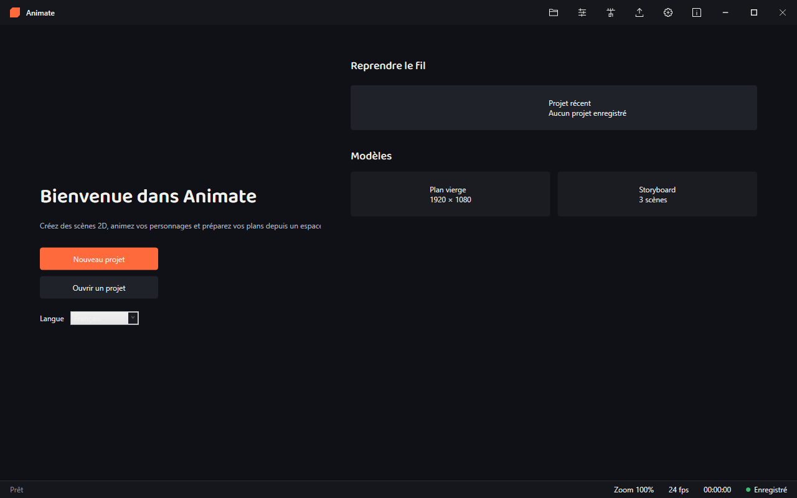
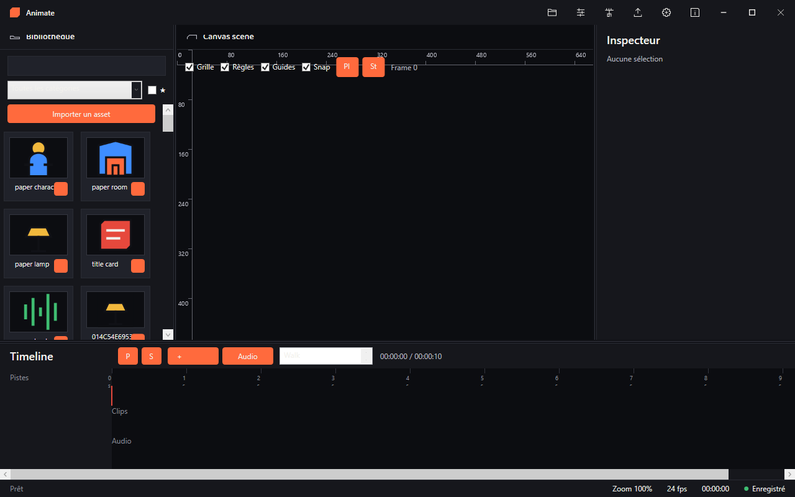
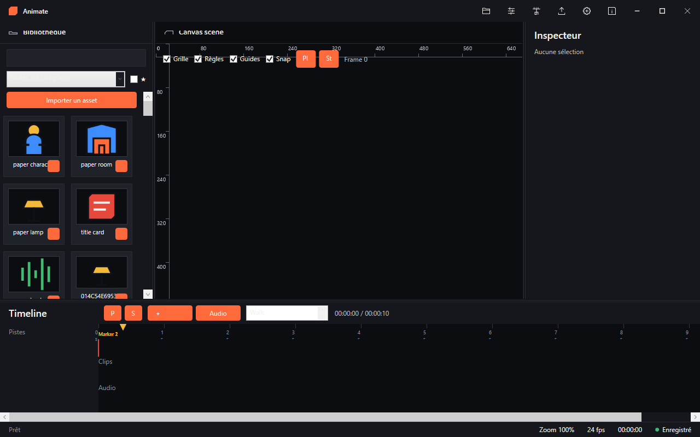
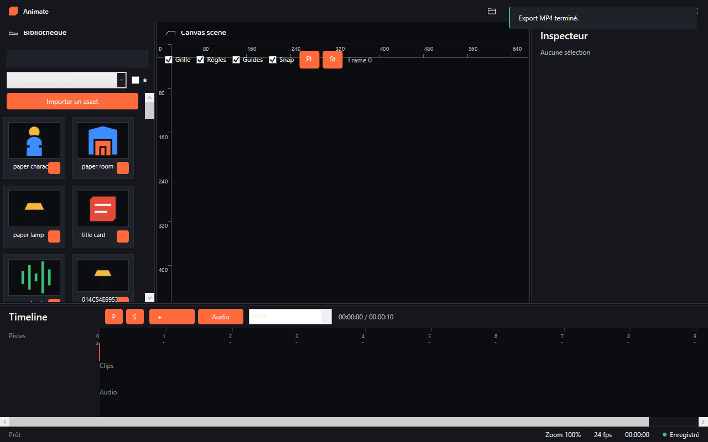

# Animate

**Logiciel d'animation 2D cutout avec export vidéo, pour Windows 11.**

[Télécharger](#téléchargement) · [Fonctionnalités](#fonctionnalités) · [Captures d'écran](#captures-décran) · [À propos](#à-propos)

---

## Sommaire

- [Présentation](#présentation)
- [Fonctionnalités](#fonctionnalités)
- [Captures d'écran](#captures-décran)
- [Prérequis](#prérequis)
- [Téléchargement](#téléchargement)
- [Installation](#installation)
- [Utilisation rapide](#utilisation-rapide)
- [Internationalisation](#internationalisation)
- [Licence](#licence)
- [Composants tiers](#composants-tiers)
- [À propos](#à-propos)

---

## Présentation

Animate est un logiciel d'animation 2D en cutout (découpage articulé) permettant
de composer des scènes à partir d'une bibliothèque d'assets (personnages, décors,
objets), de les animer sur une timeline à base de keyframes, puis d'exporter le
résultat en vidéo via FFmpeg.

L'espace de travail réunit quatre zones redimensionnables : **Bibliothèque**
(gauche), **Canvas de scène** (centre, rendu SkiaSharp), **Inspecteur de
propriétés** (droite) et **Timeline** (bas). Le rendu du canvas tient largement
au-delà de 60 fps sur un plan chargé (voir [docs/PERFORMANCE.md](docs/PERFORMANCE.md)).

## Fonctionnalités

- [x] Écran d'accueil, modèles et démarrage d'un nouveau projet
- [x] Panneaux redimensionnables, masquables et restaurables
- [x] Barre de statut (zoom, fps, durée, état de sauvegarde)
- [x] Notifications toast et transitions animées du shell
- [x] Modèle de projet, scènes, calques et références d'assets
- [x] Keyframes avec interpolations linéaire, easing et stepped
- [x] Persistance JSON versionnée des fichiers `.animate` et auto-save récupérable
- [x] Undo/Redo global et réorganisation des scènes
- [x] Bibliothèque d'assets avec recherche, catégories, tags, favoris et import
- [x] Glisser-déposer d'un asset vers le Canvas pour créer un calque
- [x] Canvas SkiaSharp avec compositing SVG/bitmap, zoom, pan, sélection et playback
- [x] Compositing par z-index avec transformations, opacité et clipping par calque
- [x] Grille, règles graduées, guides d'alignement et snapping configurable
- [x] Masques de découpe rectangulaires/elliptiques et calques texte
  (bulles de dialogue, cartons de titre)
- [x] Timeline custom avec pistes, keyframes, règle, scrub et lecture synchronisée
- [x] Marqueurs de scènes, audio synchronisé avec waveform et cycles d’animation
- [x] Lip-sync simplifié avec mapping phonème → variante de bouche
- [x] Inspecteur de calques avec transformations, opacité, couleurs et effets
- [x] Génération de vignettes PNG mises en cache pour les sources SVG/PNG
- [x] Réorganisation drag & drop des calques et clips de Timeline
- [x] Export MP4 H.264/AAC via FFmpeg embarqué, avec mixage audio et fondus
- [x] Canvas de scène SkiaSharp (rendu > 60 fps sur plan chargé)
- [x] Timeline à keyframes avec lecture temps réel
- [x] Presets d'export 480p / 1080p et file d'attente séquentielle
- [x] Interface Français / Anglais avec changement de langue à chaud
- [x] Raccourcis de sauvegarde/ouverture configurables et projets récents avec miniature

## Captures d'écran

| Accueil | Canvas + Bibliothèque |
|---|---|
|  |  |

| Timeline | Export |
|---|---|
|  |  |

## Prérequis

- Windows 11 (64 bits, x64)
- Aucun runtime à installer : l'application est distribuée autonome
  (self-contained) avec FFmpeg embarqué

## Téléchargement

La dernière version est publiée sur la page
[**Releases**](https://github.com/patrickjaillet/animate/releases) du dépôt :
téléchargez l'installateur `Animate-<version>-Setup.exe`.

## Installation

L'installateur Windows 11 est généré avec Inno Setup 7. Il installe les
binaires, FFmpeg, les assets et les fichiers i18n, puis peut créer un raccourci
Bureau et associer les fichiers `.animate` à Animate. La désinstallation se fait
depuis *Paramètres Windows › Applications* et retire l'ensemble des fichiers
installés.

## Utilisation rapide

1. **Nouveau projet** depuis l'écran d'accueil (ou un modèle : plan vierge,
   storyboard).
2. Faites glisser un asset de la **Bibliothèque** vers le **Canvas** pour créer
   un calque.
3. Ajustez position, rotation, échelle, opacité et couleurs dans l'**Inspecteur**.
4. Posez des **keyframes** sur la **Timeline**, ajoutez marqueurs et pistes
   audio, puis prévisualisez avec Lecture.
5. **Exporter** (bouton de la barre de titre) → choisissez un fichier `.mp4` ;
   l'encodage H.264/AAC via FFmpeg s'exécute en arrière-plan, une notification
   confirme la fin.

`Ctrl+S` / `Ctrl+O` enregistrent et ouvrent un projet `.animate` (raccourcis
personnalisables dans les Réglages).

## Internationalisation

Animate est disponible en **français** et en **anglais**. La langue peut être
changée depuis l'écran d'accueil ou l'écran Réglages, sans redémarrage du
logiciel.

## Licence

Animate est distribué sous licence **Freeware** — le code source n'est pas
fourni. Voir le fichier [LICENSE](LICENSE) pour le détail des conditions
d'utilisation.

## Composants tiers

Animate embarque et/ou s'appuie sur les composants tiers suivants :

- **FFmpeg** — encodage vidéo (mention légale complète dans l'onglet
  *À propos* du logiciel)
- **Baloo 2** (The Baloo 2 Project Authors) — police display arrondie
  (titres, en-têtes), licence [SIL Open Font License 1.1](assets/fonts/Baloo2/OFL.txt)
- **JetBrains Mono** (The JetBrains Mono Project Authors) — police technique
  (UI dense, valeurs numériques), licence [SIL Open Font License 1.1](assets/fonts/JetBrainsMono/OFL.txt)
- Bibliothèques .NET utilisées lors de la compilation, sous leurs licences
  open-source respectives

## À propos

**Animate**
Copyright © 2026 Patrick JAILLET — Tous droits réservés
E-mail : sandefjord.development@proton.me
Site web : https://patrickjaillet.github.io/animate

---

_Ce fichier est mis à jour à chaque implémentation notable, conformément aux
conventions de développement du projet._

